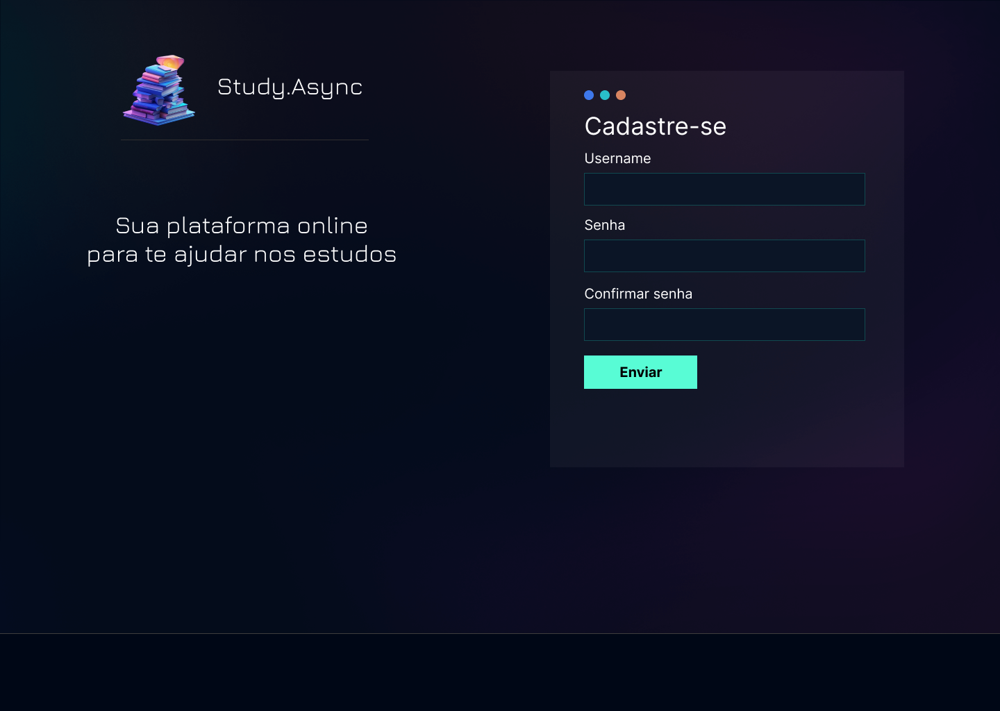
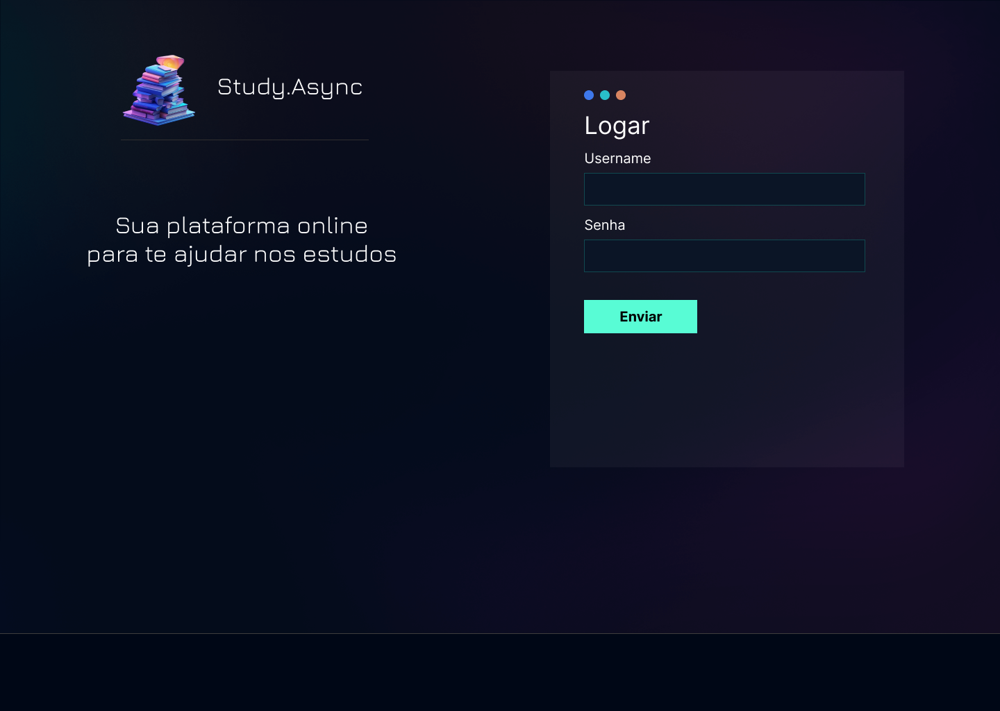
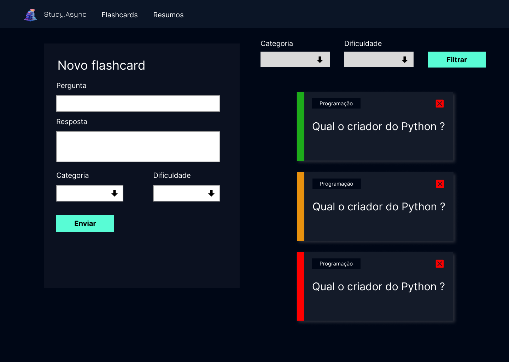
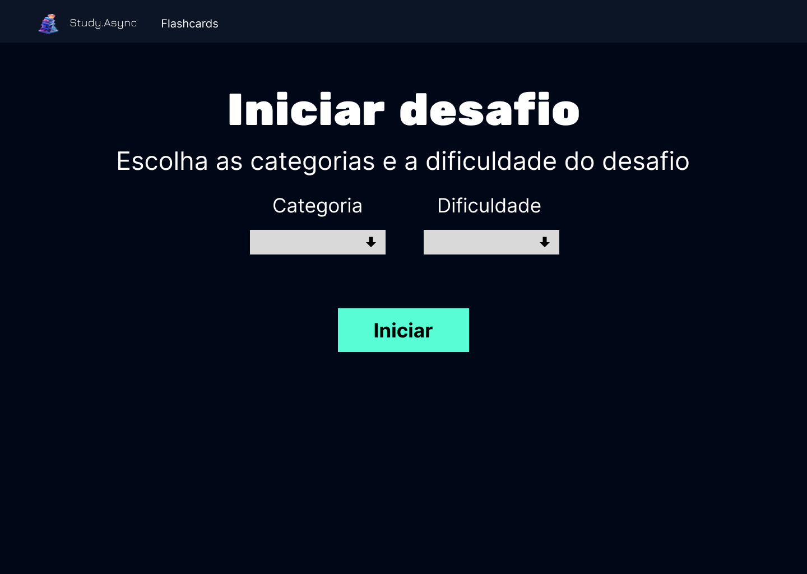
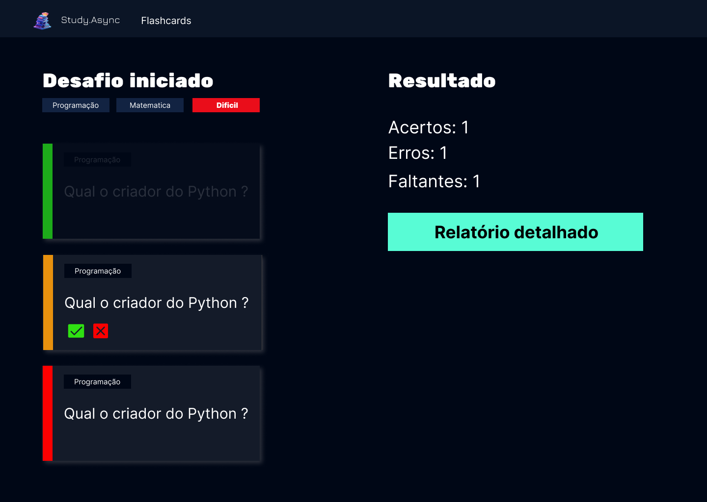

# About the Project

[](https://www.python.org/downloads/release)
[](https://docs.djangoproject.com/en/stable/releases/)
[](https://developer.mozilla.org/en-US/docs/Web/Guide/HTML/HTML5)
[](https://developer.mozilla.org/en-US/docs/Web/CSS)


This project was developed during [PSW 9.0](https://pythonando.com.br/psw/inscricao/psw9.0) of [Pythonando](https://pythonando.com.br), serving as an application for studying and memorising flashcards. Users can create flashcards to solidify their knowledge of different subjects.

## Project dependencies

- Python 3.10 or higher. 
- Poetry (Package Manager).

## Application Preview

Include here representative images of the application's operation and interface.

**Example












## Project structure

The Django project consists of 5 applications, in addition to the central core.

```bash
.
├── backend
│ ├── core
│ ├── users
│ ├── flashcards 
│ ├── challenges
│ ├── books
│ ├── reports
│ ├── templates
│ └── manage.py
├── poetry.lock
├── pyproject.toml
└── README.md

```

## Installing the dependencies

First install the project's dependencies in a virtual environment:

```bash
poetry install
```

## Activating the virtual environment

Run the command below to activate the virtual environment created by poetry:

```bash
poetry shell
```

## Run the migrations

Run the migrations using the following command:

```bash
task migrations
```

## Run the project

To start the project, use the following command:

```bash
task run
```
